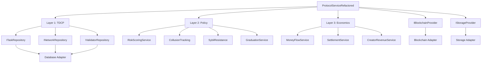

# Tenseuron Architecture

**Three-layer breakdown of the reference network.**

This document explains how Tenseuron is structured, what can be swapped, and what's core.

---

## The Three Layers

```
┌─────────────────────────────────────────────────────────────┐
│                   Layer 3: Marketplace                       │
│              (Creator Economics, Payments)                   │
├─────────────────────────────────────────────────────────────┤
│                   Layer 2: Network Policy                    │
│         (Reputation, Risk, Collusion, Graduation)           │
├─────────────────────────────────────────────────────────────┤
│                   Layer 1: TDCP Protocol                     │
│              (Tasks, Agents, Evaluation)                     │
└─────────────────────────────────────────────────────────────┘
```

---

## Layer 1: TDCP (Protocol Core)

**What it is**: The minimum required for coordination

**Components**:
- Task schema and lifecycle
- Agent identity (Miners, Validators, Creators)
- Claim/execute/submit flow
- Evaluation result format
- Reward signal structure

**Files**:
```
/specs/Task.md
/specs/Agent.md
/specs/Evaluation.md
/interfaces/ITaskRepository.ts
/interfaces/INetworkRepository.ts
/interfaces/IValidatorRepository.ts
/types.ts
```

**Can be swapped**: No - this is the protocol
**Can be extended**: Yes - add new task types, agent roles

---

## Layer 2: Network Policy

**What it is**: How the reference network behaves under adversarial conditions

### Reputation System
**Purpose**: Track agent performance over time

**Files**:
- `interfaces/ICreatorReputationService.ts`
- Implementations in launchpad or custom adapters

**Policy choices**:
- Reputation decay: Exponential
- Minimum reputation for privileges: Configurable
- Reputation recovery: Possible through good behavior

**Can be swapped**: Yes - implement different reputation logic
**Can be removed**: Yes - for trusted environments

---

### Risk Scoring
**Purpose**: Evaluate network and agent risk

**Files**:
- `RiskScoringService.ts`

**Policy choices**:
- Risk factors: Creator history, network parameters, task complexity
- Risk thresholds: Configurable
- Risk decay: Exponential over successful tasks

**Can be swapped**: Yes - implement custom risk models
**Can be removed**: Yes - if risk is managed externally

---

### Collusion Detection
**Purpose**: Identify coordinated gaming attempts

**Files**:
- `CollusionTrackingService.ts`
- `CollusionPreventionService.ts`

**Policy choices**:
- Detection signals: Timing patterns, validator relationships
- Strike system: 3 strikes default
- Penalties: Reputation loss, temporary bans

**Can be swapped**: Yes - different detection algorithms
**Can be removed**: Yes - for trusted networks

---

### Sybil Resistance
**Purpose**: Prevent identity manipulation

**Files**:
- `SybilResistanceService.ts`

**Policy choices**:
- Requirements: Stake + reputation
- Verification: Multi-factor
- Penalties: Stake slashing

**Can be swapped**: Yes - different verification methods
**Can be removed**: Yes - if identities are verified externally

---

### Graduation System
**Purpose**: Manage network lifecycle and privileges

**Files**:
- `GraduationService.ts`
- `BootstrapModeService.ts`

**Policy choices**:
- Bootstrap mode: First 100 tasks
- Graduation threshold: 1000 successful tasks
- Privileges: Increased task limits, lower fees

**Can be swapped**: Yes - different lifecycle rules
**Can be removed**: Yes - all networks can have full privileges

---

## Layer 3: Marketplace/Platform

**What it is**: Full economic and operational layer

### Creator Economics
**Purpose**: Manage creator revenue and incentives

**Files**:
- `MoneyFlowService.ts`
- `CreatorRevenueService.ts`

**Policy choices**:
- Revenue split: 70/30 (creator/protocol)
- Bond requirements: Risk-adjusted
- Refund policy: After graduation

**Can be swapped**: Yes - different economic models
**Can be removed**: No - economics are core to coordination

---

### Settlement System
**Purpose**: Execute payments and rewards

**Files**:
- `SettlementService.ts`

**Policy choices**:
- Validator rewards: Performance-based
- Payment timing: After evaluation consensus
- Currency: Native blockchain tokens

**Can be swapped**: Yes - different payment logic
**Can be removed**: No - payments are required

---

### Scam Defense
**Purpose**: Protect participants from fraudulent networks

**Files**:
- `ScamDefenseService.ts`

**Policy choices**:
- Detection signals: Multiple factors
- Response: Automatic flagging, manual review
- Recovery: Refunds for scam victims

**Can be swapped**: Yes - different detection methods
**Can be removed**: Yes - if scams are managed externally

---

## Adapter Architecture

### Database Adapters
**Purpose**: Work with any database

**Interfaces**:
- `INetworkRepository`
- `ITaskRepository`
- `IValidatorRepository`

**Implementations**:
- `PrismaNetworkRepository` (PostgreSQL, MySQL, SQLite)
- `D1NetworkRepository` (Cloudflare D1)
- Custom implementations

**How to swap**:
```typescript
// Use Prisma
const networkRepo = new PrismaNetworkRepository(prisma, logger);

// Use D1
const networkRepo = new D1NetworkRepository(d1Database);

// Use custom
const networkRepo = new CustomDatabaseRepository(yourDb);
```

---

### Blockchain Adapters
**Purpose**: Work with any blockchain

**Interface**:
- `IBlockchainProvider`

**Implementations**:
- `EthereumProvider` (Ethereum, Polygon)
- `SolanaHTTPProvider` (Solana)
- Custom implementations

**How to swap**:
```typescript
// Use Ethereum
const blockchain = new EthereumProvider(rpcUrl, privateKey);

// Use Solana
const blockchain = new SolanaHTTPProvider(rpcUrl, privateKey);

// Use custom
const blockchain = new CustomBlockchainProvider(config);
```

---

### Storage Adapters
**Purpose**: Work with any storage backend

**Interface**:
- `IStorageProvider`

**Implementations**:
- `IPFSStorageProvider`
- `CloudflareR2StorageProvider`
- `S3StorageProvider`
- Custom implementations

**How to swap**:
```typescript
// Use IPFS
const storage = new IPFSStorageProvider();

// Use R2
const storage = new CloudflareR2StorageProvider(r2Bucket);

// Use custom
const storage = new CustomStorageProvider(config);
```

---

## Dependency Graph



---

## What Can Be Swapped

### Easy to Swap (Adapters)
✅ Database (Prisma → D1 → MongoDB)
✅ Blockchain (Ethereum → Solana → Custom)
✅ Storage (IPFS → R2 → S3)

### Medium Difficulty (Services)
⚠️ Risk scoring logic
⚠️ Collusion detection
⚠️ Reputation calculation
⚠️ Economic parameters

### Hard to Swap (Core)
❌ TDCP protocol structure
❌ Task lifecycle
❌ Agent roles
❌ Evaluation format

---

## Design Decisions

### Why Three Layers?

**Separation of concerns**:
- Layer 1: What coordination requires (minimal)
- Layer 2: How to behave safely (opinionated)
- Layer 3: How to sustain economically (complete)

**Enables**:
- Minimal forks (Layer 1 only)
- Policy forks (Layer 1 + custom Layer 2)
- Full forks (all three layers customized)

---

### Why Adapters?

**Flexibility**:
- Run anywhere (Node.js, Workers, Deno)
- Use any database
- Support any blockchain

**Testability**:
- Mock adapters for testing
- Swap implementations easily

**Future-proofing**:
- New databases: just add adapter
- New blockchains: just add adapter

---

### Why Dependency Injection?

**Modularity**:
- Services don't know about concrete implementations
- Easy to swap components

**Testability**:
- Inject mocks for testing
- Test services in isolation

**Flexibility**:
- Different configurations for different environments
- Runtime-specific optimizations

---

## Runtime Configurations

### Node.js (Express/Fastify)
```typescript
const protocol = ProtocolServiceFactory.createForNode(logger, prisma);
```

**Uses**:
- Prisma for database
- IPFS for storage
- Ethereum/Polygon for blockchain

---

### Cloudflare Workers
```typescript
const protocol = ProtocolServiceFactory.createForWorkers(logger, env);
```

**Uses**:
- D1 for database
- R2 for storage
- HTTP providers for blockchain

---

### Custom Configuration
```typescript
const protocol = ProtocolServiceFactory.create(logger, {
  database: { type: 'custom', instance: yourDb },
  storage: { type: 'custom', config: yourStorage },
  blockchain: { type: 'custom', config: yourBlockchain }
});
```

---

## Trade-offs

### Completeness vs Simplicity
**Choice**: Completeness
**Rationale**: Better to have and not need than need and not have
**Cost**: Higher learning curve
**Benefit**: Production-ready from day one

### Opinions vs Neutrality
**Choice**: Opinions
**Rationale**: Defaults shape behavior; be explicit
**Cost**: Not one-size-fits-all
**Benefit**: Clear design intent, easier to fork

### Adapters vs Direct Integration
**Choice**: Adapters
**Rationale**: Flexibility and testability
**Cost**: Extra abstraction layer
**Benefit**: Works anywhere, easy to swap

---

## For Developers

### Adding a New Adapter

1. **Implement the interface**:
```typescript
export class MyDatabaseAdapter implements INetworkRepository {
  // Implement all methods
}
```

2. **Register with factory** (optional):
```typescript
// In ProtocolFactory.ts
if (config.database.type === 'mydb') {
  return new MyDatabaseAdapter(config.database.instance);
}
```

3. **Test**:
```typescript
const adapter = new MyDatabaseAdapter(db);
const network = await adapter.create(params);
expect(network.id).toBeDefined();
```

---

### Adding a New Service

1. **Create the service**:
```typescript
export class MyPolicyService {
  constructor(private logger: ILogger) {}
  
  async evaluatePolicy(params: any): Promise<boolean> {
    // Your logic
  }
}
```

2. **Add to dependencies**:
```typescript
export interface ProtocolServiceDependencies {
  // ... existing
  myPolicyService: MyPolicyService;
}
```

3. **Use in ProtocolService**:
```typescript
const allowed = await this.myPolicyService.evaluatePolicy(params);
```

---

## For Forkers

### Minimal Fork (Layer 1 Only)
**Keep**: TDCP core, adapters
**Remove**: All Layer 2 and 3 services
**Result**: ~30% of codebase

### Policy Fork (Layer 1 + Custom Layer 2)
**Keep**: TDCP core, adapters, Layer 3
**Replace**: Risk, collusion, reputation logic
**Result**: ~70% of codebase + your policies

### Full Fork (All Layers Custom)
**Keep**: Adapter architecture
**Replace**: Everything else
**Result**: Framework only, all logic custom

---

**This architecture is designed for forkability, not rigidity.**

**Swap what you need. Keep what works.**

**See [FORK_GUIDE.md](./FORK_GUIDE.md) for how.**
